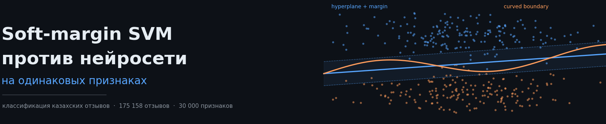
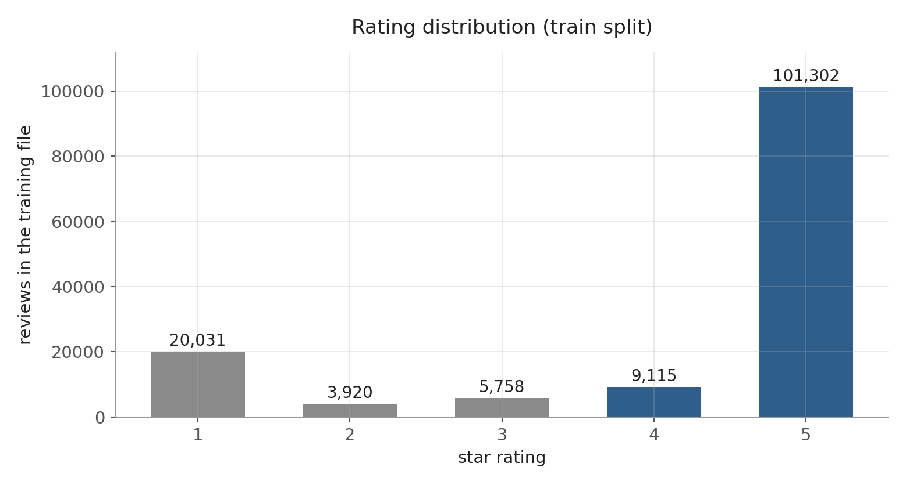
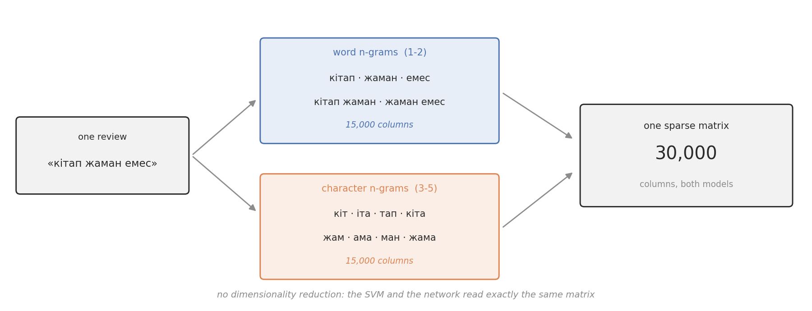
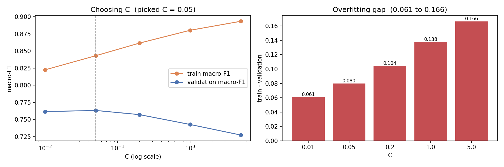
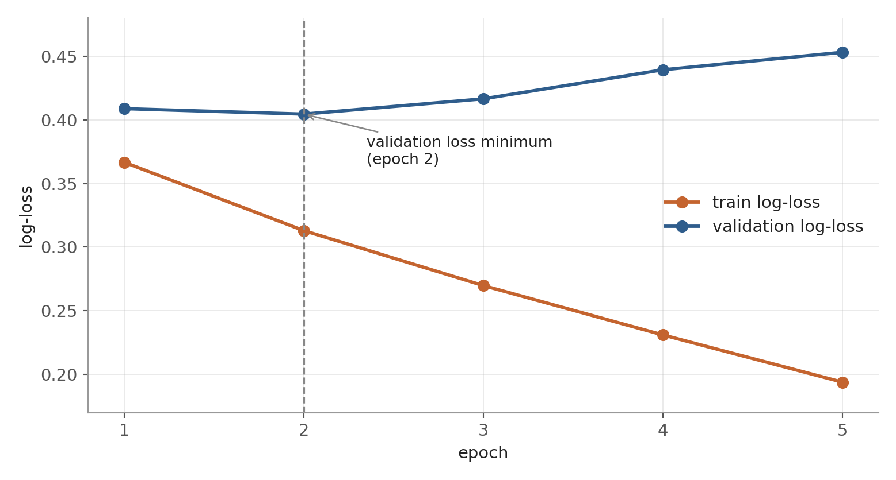
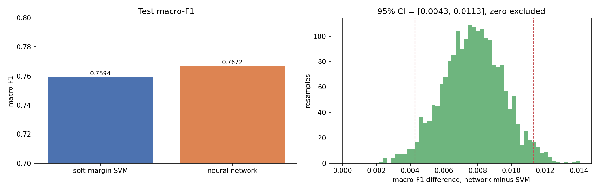
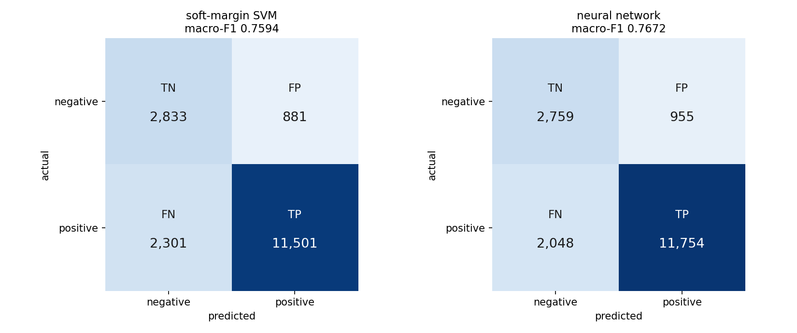

Обе модели получают одну и ту же матрицу признаков, одно и то же разбиение, одну и ту же балансировку классов. Отличается только способ разделения классов: у SVM гиперплоскость, у сети изогнутая граница.

**Датасет:** [KazSAnDRA](https://github.com/IS2AI/KazSAnDRA) (ISSAI, Назарбаев Университет, CC BY 4.0) · 175 158 отзывов · 30 000 признаков
**Ноутбук:** [открыть в Google Colab](https://colab.research.google.com/drive/1dVVak_yOdTjFR9pKDdkr5_54XoF5tm-J)

---

## Исследовательский вопрос

> «Даёт ли нейронная сеть значимый выигрыш в качестве над линейным soft-margin SVM, если обе модели получают ровно одни и те же признаки, и стоит ли этот выигрыш своей цены?»

---

## Библиотеки

`scikit-learn` (`TfidfVectorizer`, `LinearSVC`, `MLPClassifier`, `metrics`), `numpy`, `pandas`, `scipy.sparse`, `matplotlib`

---

## Метрики

Для оценки моделей используются:

- Precision
- Recall
- F1
- Macro-F1
- ROC-AUC
- Log-loss

Обозначения:

- **TP** — отзыв положительный, и модель угадала
- **FP** — отзыв на самом деле негативный, а модель назвала его positive
- **FN** — отзыв на самом деле positive, а модель назвала его негативным
- **TN** — отзыв негативный, и модель угадала

Precision:

$$\large Precision = \frac{TP}{TP + FP}$$

Recall:

$$\large Recall = \frac{TP}{TP + FN}$$

F1:

$$\large F1 = 2 \cdot \frac{Precision \cdot Recall}{Precision + Recall}$$

Macro-F1:

$$\large \text{Macro-F1} = \frac{F1_{negative} + F1_{positive}}{2}$$

Log-loss:

$$\large \text{Log-loss} = -\frac{1}{n}\sum_{i=1}^{n}\Big[y_i \log p_i + (1 - y_i)\log(1 - p_i)\Big]$$

Sigmoid:

$$\large \sigma(z) = \frac{1}{1 + e^{-z}}$$

**Macro-F1** — основная метрика сравнения: по ней подбирается C, архитектура сети и её разницу проверяет bootstrap в результатах.

**ROC-AUC** — сверочная метрика: не зависит от масштаба score, которая сравнивает SVM и сеть напрямую.

**Log-loss** — входит в обучение сети и строит кривые train/validation, определяет early stopping и в финальном сравнении не участвует.

**Activation function** — Выход сети — sigmoid, вероятность (0, 1).

---

## Данные

| Источник | Отзывов | Объектов |
|---|---|---|
| Магазин приложений | 135 073 | 1 759 приложений |
| Маркетплейсы | 30 289 | 8 418 товаров |
| Карты | 8 897 | 407 мест |
| Книжный | 5 805 | 1 026 книг |

`Отзывы оцениваются в виде звезд от 1 до 5`

Собрано авторами 180 064, после очистки и дедупликации осталось 175 158.

| Train | Validation | Test |
|---|---|---|
| 140 126 | 17 516 | 17 516 |

**Свойства данных:**

- медиана длины отзыва — 6 слов
- казахский и русский смешаны внутри одного предложения, кириллица с латиницей тоже
- 78.8% отзывов положительные

**Labelling:**

| Звёзды | Класс |
|---|---|
| 1, 2, 3 | negative |
| 4, 5 | positive |

---

## Признаки

TF-IDF — способ превратить отзыв в числа так, чтобы важные слова получили больший вес, а неважные — меньший.

Смысл простой: если слово мало где встречается и при этом много раз повторяется именно в этом отзыве — оно важное. Если слово встречается почти в каждом отзыве — оно неважное, потому что не помогает отличить один отзыв от другого.

$$\large \text{tfidf}(i, t) = \text{tf}(i, t)\cdot\log\frac{N}{\text{df}(t)}$$

- **tf** — сколько раз это слово встретилось в конкретном отзыве
- **df** — в скольких отзывах вообще есть это слово
- **N** — сколько всего отзывов

Используем два вида признаков одновременно, и оба считаются одинаково по формуле выше:

**1. Целые слова и пары слов подряд.** Из отзыва «кітап жаман емес» получаем: `кітап`, `жаман`, `емес`, `кітап жаман`, `жаман емес`. Пары слов нужны из-за отрицания: `жаман` — плохо, а `жаман емес` — неплохо, противоположный смысл. Если брать только отдельные слова, это отрицание потеряется. Таких признаков — 15 000.

**2. Куски слов из 3-5 букв.** Из слова «кітап» получаем: `кіт`, `іта`, `тап`, `кіта`, `ітап`. Это нужно потому что казахский язык сильно меняет форму слова — `кітап`, `кітабы`, `кітапты` для модели три разных слова, если брать их целиком, а по кускам букв видно, что корень один и тот же. Заодно это спасает от опечаток: одна лишняя буква портит только пару кусков, а не всё слово целиком. Ещё 15 000 признаков.

Оба набора складываются вместе в одну таблицу чисел — 30 000 признаков на каждый отзыв. И SVM, и сеть получают ровно эти же 30 000 чисел, без урезания и без сжатия — поэтому сравнение честное.

**Data leakage** — Словарь и веса TF-IDF считаются только по train: validation и test проходят через готовый словарь без пересчёта, иначе оценка модели была бы завышена.

Пары слов ловят отрицание на практике: `жаман` = плохо, `жаман емес` = неплохо, и это самый сильный положительный вес во всей модели, +1.238.

---

## Model 1: soft-margin SVM

`LinearSVC(C=0.05, loss="squared_hinge", dual="auto", max_iter=6000, tol=1e-4)`

В коде метки `y ∈ {0, 1}` — этого требует scikit-learn. Формула ниже написана для `ỹ = 2y − 1 ∈ {−1, +1}`, потому что hinge loss работает именно с такими метками: правильный уверенный ответ должен делать произведение `ỹᵢf(xᵢ)` положительным. Это одна и та же метка в двух записях; преобразование scikit-learn делает сам.

Разделяющая функция:

$$\Large f(x) = w^{\top}x + b$$

Задача оптимизации:

$$\Large \min_{w,b}\ \frac{1}{2}\lVert w \rVert^{2} + C \sum_{i=1}^{n} \Big[\max\big(0,\ 1 - \tilde{y}_i\,f(x_i)\big)\Big]^{2}$$

Экспонента соответствует `squared_hinge`, дефолту sklearn. Классический hinge loss — `max(0, 1 − ỹ·f(x))` без квадрата.

**Margin** — полоса между `f(x) = −1` и `f(x) = +1` вокруг гиперплоскости. Мягкой она называется потому, что точкам разрешено находиться внутри полосы и на чужой стороне: жалоба и похвала могут состоять почти из одних и тех же слов, hard margin решения не имеет. **C** — цена такого нарушения: малый C оставляет полосу широкой, большой сужает её вокруг обучающих точек.

**Decision score против distance.** Функция решения возвращает f(x) — functional margin, не расстояние. Геометрическое расстояние до гиперплоскости:

$$\Large d(x) = \frac{\lvert w^{\top}x + b \rvert}{\lVert w \rVert}$$

При `‖w‖ = 30.422` score 1.0 соответствует расстоянию 0.033.

### Подбор C

train macro-F1 растёт монотонно, validation достигает максимума на C = 0.05 и падает. Расхождение кривых и есть overfitting: gap растёт с 0.061 до 0.166. C выбран по максимуму validation, test при подборе не использовался.

---

## Model 2: neural network

`MLPClassifier(hidden_layer_sizes=(64,), activation="relu", solver="adam", alpha=1e-3, learning_rate_init=2e-4, batch_size=256)`

Вход — та же матрица 30 000, без сжатия. Прямой проход:

$$\Large h = \mathrm{ReLU}(W_1 x + b_1)$$

$$\Large p = \sigma(W_2 h + b_2) = \frac{1}{1 + e^{-(W_2 h + b_2)}}$$

$$\Large \mathrm{ReLU}(z) = \max(0,\ z)$$

ReLU и sigmoid — activation functions: без них стек слоёв сворачивается в одно линейное отображение, и сеть не сможет выразить ничего, чего не может SVM. Класс решается порогом $p > 0.5$.

| Параметр | Значение | Смысл |
|---|---|---|
| `alpha` | 1e-3 | коэффициент L2-штрафа `α·Σw²` в функции потерь; единственный регуляризатор, dropout не используется |
| `learning_rate_init` | 2e-4 | размер шага при одном обновлении весов. Выбор проверен в коде: ноутбук обучает выбранную архитектуру на подвыборке при 1e-3 и при 2e-4 и печатает validation macro-F1 по эпохам. Дефолтный шаг сильнее теряет от своего пика к концу проверки; на полном прогоне 2e-4 даёт один чистый внутренний максимум на 4-й эпохе, что и нужно early stopping |
| `batch_size` | 256 | число примеров, после которых обновляются веса |
| epoch | до 15 | один полный проход по всей обучающей выборке |
| early stopping | patience 4 | обучение останавливается после 4 эпох без роста validation macro-F1 |

Архитектура выбрана перебором трёх вариантов на подвыборке 50 000 строк: (64,) → 0.7607, (128, 32) → 0.7651, (256, 64) → 0.7598. Разброс между ними 0.0053, то есть в пределах шума, поэтому из попавших в допуск 0.005 взят наименьший вариант — (64,).

### Обучение

train log-loss падает монотонно — это величина, которую минимизирует оптимизатор. validation log-loss достигает минимума на epoch 4 и разворачивается вверх: дальнейшие эпохи покупают запоминание train, а не обобщение. Модель для теста берётся с лучшей эпохи по validation macro-F1, поздние отбрасываются; обучение остановилось на epoch 8.

В этом прогоне минимум validation log-loss и максимум validation macro-F1 совпали на epoch 4. Совпадать они обязаны не всегда: log-loss непрерывен по вероятности, а macro-F1 меняется только когда отзыв пересекает порог 0.5, поэтому эпоха-победитель по этим двум критериям может отличаться.

---

## Результаты

Тестовая выборка 17 516 отзывов

| | macro-F1 | accuracy | ROC-AUC | параметров | время |
|---|---|---|---|---|---|
| soft-margin SVM | 0.7594 | 0.8183 | 0.8708 | 30 000 | ~10 с |
| neural network | 0.7672 | 0.8286 | 0.8754 | 1 920 129 | ~4 мин |

Разница 0.0078 в пользу сети. Величина достаточно мала, чтобы её проверять, а не констатировать: тестовая выборка пересобиралась 2 000 раз, обе метрики пересчитывались заново. **95% bootstrap CI = [0.0043, 0.0113]**, преимущество нейронной сети несмотря ни на что не пропадает при пересборке теста.

---

## Анализ ошибок

| | значение |
|---|---|
| обе модели ошиблись | 2 746 отзывов (15.68%) |
| модели разошлись | 693 отзыва (3.96%) |

Общих ошибок вчетверо больше, чем расхождений — основная часть остаточной ошибки принадлежит данным, а не моделям. Среди общих ошибок есть отзывы с явно положительным текстом и оценкой в одну звезду; авторы датасета фиксируют то же самое.

**Accuracy по источникам:**

| источник | SVM | neural network |
|---|---|---|
| маркетплейсы | 0.930 | 0.933 |
| карты | 0.875 | 0.878 |
| приложения | 0.792 | 0.804 |
| книжный | 0.770 | 0.780 |

Разброс между источниками около 16 пунктов против 0.8 пункта между моделями.

**Интерпретируемость SVM заодно показывает вот что:** в топе весов присутствуют `1жұлдыз`, `бір жұлдыз`, `4жұлдыз` — авторы отзывов дублируют свой rating словами внутри текста. Такие слова упрощают задачу.

---

## Вывод

Сеть выигрывает 0.0078 macro-F1, и bootstrap подтверждает, что выигрыш не случаен. Однако отрыв мал, обе модели упорядочивают отзывы почти одинаково (ROC-AUC 0.8708 против 0.8754), и платит сеть за него в 64 раза большим числом параметров и примерно в 25 раз большим временем обучения, а также полной потерей интерпретируемости.

Обе модели ошибаются на одних и тех же 15.68% отзывов и расходятся лишь на 3.96% — потолок задачи задаётся шумом разметки, а не выбором классификатора. Разброс по источникам данных (около 16 пунктов) на порядок превышает разброс между моделями (0.8 пункта).

По совокупности этих факторов для данной задачи практичнее soft-margin SVM: он достигает 99% качества сети, обучается за секунды вместо минут и способен назвать конкретные казахские слова, определившие решение. Проигрыш в macro-F1 существует и статистически значим, но невелик, а выигрыш в скорости и прозрачности значительный!

---

## Ограничения

**Данные**

- Использован один датасет
- Шума в данных много из за того что люди могут писать гневный комментарий, но поставить хорошую оценку или наоборот
- Отзывы очень короткие, медиана 6 слов — извлекать модели почти нечего
- Слова с названием rating внутри текста упрощают задачу

**Модель**

- Проверена одна схема labelling из трёх возможных; поведение при 3 звёздах как `positive` или при их исключении не измерялось
- Вывод справедлив для этих двух конфигураций, а не для двух семейств моделей вообще
- Character n-grams не связывают латиницу и кириллицу

## Дальнейшая работа

- Ручная проверка сотни общих ошибок с подсчётом доли реально неверных меток — это даст численный потолок точности задачи
- Повторный прогон с исключением rating-слов из словаря
- Проверить чувствительность результата к схеме labelling
- Расширить поиск архитектуры, чтобы победитель отражал форму сети, а не шум подвыборки

---

## Воспроизведение

Открыть [ноутбук в Colab](https://colab.research.google.com/drive/1dVVak_yOdTjFR9pKDdkr5_54XoF5tm-J) и выполнить `Restart Runtime → Run All`. Датасет скачивается первой ячейкой. Полный прогон ~25 минут на CPU.

## Источник данных

Yeshpanov R., Varol H. A. *KazSAnDRA: Kazakh Sentiment Analysis Dataset of Reviews and Attitudes.* LREC-COLING 2024. [arXiv:2403.19335](https://arxiv.org/abs/2403.19335)
